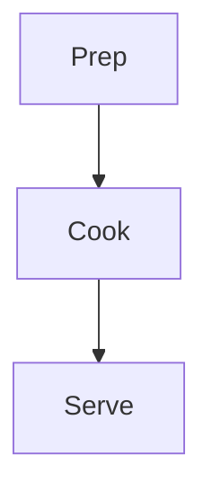

# Mermaid Diagrams in Jinja Reports Implementation Plan

> **For agentic workers:** REQUIRED SUB-SKILL: Use superpowers:subagent-driven-development (recommended) or superpowers:executing-plans to implement this plan task-by-task. Steps use checkbox (`- [ ]`) syntax for tracking.

**Goal:** Render Mermaid diagrams embedded as ` ```mermaid ` fenced code blocks inside markdown-format Jinja reports, both in the live report widget and in exported PDF/PNG/print output.

> **Correction (applied during execution).** Tasks 2/3/5 below assume Theia's markdown renderer emits `<pre><code class="language-mermaid">` and that a post-render DOM scan can replace it. That is wrong: the bound renderer is Monaco's `MarkdownRendererService`, which feeds fenced code blocks to a `codeBlockRenderer(languageId, value)` callback. The shipped code (commit `fix(cooklang): render mermaid via markdown codeBlockRenderer`) replaces `findMermaidBlocks`/`extractMermaidSource`/`renderInto` with `MermaidRenderer.renderDiagram(source, theme)` and a `MermaidMarkdown` component (`report-markdown.tsx`) that renders markdown imperatively with a mermaid-aware `codeBlockRenderer`. Read this note alongside Tasks 2/3/5. Tasks 1, 4, 6, 7 are unchanged.

**Architecture:** Theia's Monaco-backed `MarkdownRenderer` feeds fenced code blocks to a `codeBlockRenderer(languageId, value)` callback. A `MermaidMarkdown` component renders report markdown imperatively and supplies a `codeBlockRenderer` that delegates `mermaid` blocks to a `MermaidRenderer` service (lazily importing the `mermaid` library, themed to match the editor) and falls back to `<pre><code>` for other languages. The export path re-renders the stored diagram sources in mermaid's light theme so printed output stays legible on white paper.

**Tech Stack:** TypeScript, React 18, Theia (`MarkdownRenderer`, `Markdown` component, `ThemeService`, InversifyJS), `mermaid` (lazy dynamic import), mocha + chai + jsdom for tests.

---

## File Structure

- **Create** `packages/cooklang/src/browser/mermaid-renderer.ts` — the `MermaidRenderer` service plus pure helpers (`themeTypeToMermaidTheme`, `findMermaidBlocks`, `extractMermaidSource`). Must NOT import `@theia/monaco` (keeps the spec runnable; see project memory `feedback_spec_monaco_css_harness`).
- **Create** `packages/cooklang/src/browser/mermaid-renderer.spec.ts` — unit tests for the pure helpers (jsdom for the DOM helpers).
- **Modify** `packages/cooklang/src/browser/report-widget.tsx` — inject `MermaidRenderer` + `ThemeService`, run the post-render pass via the `Markdown` `onRender` callback, re-theme on theme change, make `getExportDocument` async.
- **Modify** `packages/cooklang/src/browser/cooklang-frontend-module.ts` (or wherever browser services are bound) — bind `MermaidRenderer` in singleton scope.
- **Modify** `packages/cooklang/src/browser/report-export-contribution.ts` — `await` the now-async `getExportDocument` at its 3 call sites.
- **Modify** `packages/cooklang/src/browser/report-export-document.ts` — add `.theia-cooklang-mermaid` rules to `REPORT_EXPORT_CSS`.
- **Modify** `packages/cooklang/src/browser/style/report.css` — add on-screen `.theia-cooklang-mermaid` rules.
- **Modify** `packages/cooklang/package.json` — add `mermaid` dependency.

---

## Task 1: Add the mermaid dependency

**Files:**
- Modify: `packages/cooklang/package.json`

- [ ] **Step 1: Add the dependency**

In `packages/cooklang/package.json`, add `mermaid` to the `dependencies` object (keep alphabetical-ish grouping with the other non-`@theia` deps near `tslib`):

```json
    "@theia/workspace": "1.70.0",
    "mermaid": "^11.4.0",
    "tslib": "^2.6.2"
```

- [ ] **Step 2: Install**

Run: `npm install`
Expected: completes without error; `node_modules/mermaid/package.json` now exists.

- [ ] **Step 3: Verify install**

Run: `node -e "console.log(require('mermaid/package.json').version)"`
Expected: prints an `11.x` version.

- [ ] **Step 4: Commit**

```bash
git add packages/cooklang/package.json package-lock.json
git commit -m "build(cooklang): add mermaid dependency for report diagrams"
```

---

## Task 2: Pure helpers in `mermaid-renderer.ts` (TDD)

This task creates the file with ONLY the pure/DOM helper functions and their tests. The `MermaidRenderer` class is added in Task 3.

**Files:**
- Create: `packages/cooklang/src/browser/mermaid-renderer.ts`
- Test: `packages/cooklang/src/browser/mermaid-renderer.spec.ts`

- [ ] **Step 1: Write the failing test**

Create `packages/cooklang/src/browser/mermaid-renderer.spec.ts`:

```ts
// *****************************************************************************
// Copyright (C) 2024-2026 cook.md and contributors
//
// SPDX-License-Identifier: AGPL-3.0-only WITH LicenseRef-cooklang-theia-linking-exception
//
// This program is free software: you can redistribute it and/or modify it
// under the terms of the GNU Affero General Public License version 3 as
// published by the Free Software Foundation, with the linking exception
// documented in NOTICE.md.
//
// See LICENSE-AGPL for the full license text.
// *****************************************************************************

// The DOM helpers need `document`; set up jsdom before importing the module.
import { enableJSDOM } from '@theia/core/lib/browser/test/jsdom';
const disableJSDOM = enableJSDOM();

import { expect } from 'chai';
import { themeTypeToMermaidTheme, findMermaidBlocks, extractMermaidSource } from './mermaid-renderer';

after(() => disableJSDOM());

describe('mermaid-renderer helpers', () => {

    it('maps theme types to mermaid themes', () => {
        expect(themeTypeToMermaidTheme('dark')).to.equal('dark');
        expect(themeTypeToMermaidTheme('hc')).to.equal('dark');
        expect(themeTypeToMermaidTheme('light')).to.equal('default');
        expect(themeTypeToMermaidTheme('hcLight')).to.equal('default');
    });

    function container(html: string): HTMLElement {
        const node = document.createElement('div');
        node.innerHTML = html;
        return node;
    }

    it('finds <pre> blocks that wrap a mermaid code fence', () => {
        const node = container(
            '<pre><code class="language-mermaid">graph TD; A--&gt;B;</code></pre>' +
            '<pre><code class="language-js">const x = 1;</code></pre>' +
            '<p>text</p>'
        );
        const blocks = findMermaidBlocks(node);
        expect(blocks).to.have.lengthOf(1);
        expect(blocks[0].tagName).to.equal('PRE');
    });

    it('returns an empty array when there are no mermaid blocks', () => {
        const node = container('<pre><code class="language-js">x</code></pre><p>none</p>');
        expect(findMermaidBlocks(node)).to.have.lengthOf(0);
    });

    it('extracts the diagram source text from a block', () => {
        const node = container('<pre><code class="language-mermaid">graph TD; A--&gt;B;</code></pre>');
        const [block] = findMermaidBlocks(node);
        expect(extractMermaidSource(block)).to.equal('graph TD; A-->B;');
    });
});
```

- [ ] **Step 2: Run the test to verify it fails**

Run: `npx lerna run compile --scope @theia/cooklang` then `npx lerna run test --scope @theia/cooklang`
Expected: FAIL — `mermaid-renderer` module / exports not found (compile error or import failure).

- [ ] **Step 3: Write the minimal implementation**

Create `packages/cooklang/src/browser/mermaid-renderer.ts`:

```ts
// *****************************************************************************
// Copyright (C) 2024-2026 cook.md and contributors
//
// SPDX-License-Identifier: AGPL-3.0-only WITH LicenseRef-cooklang-theia-linking-exception
//
// This program is free software: you can redistribute it and/or modify it
// under the terms of the GNU Affero General Public License version 3 as
// published by the Free Software Foundation, with the linking exception
// documented in NOTICE.md.
//
// See LICENSE-AGPL for the full license text.
// *****************************************************************************

import { ThemeType } from '@theia/core/lib/common/theme';

/** The subset of mermaid built-in themes this feature uses. */
export type MermaidTheme = 'default' | 'dark';

/** CSS selector for a mermaid code fence produced by the markdown renderer. */
export const MERMAID_CODE_SELECTOR = 'code.language-mermaid';

/** Map a Theia theme type to the mermaid theme used for live rendering. */
export function themeTypeToMermaidTheme(type: ThemeType): MermaidTheme {
    return (type === 'dark' || type === 'hc') ? 'dark' : 'default';
}

/**
 * Find the `<pre>` blocks inside `container` that wrap a mermaid code fence.
 * Returns the enclosing `<pre>` elements (the nodes we replace with an SVG).
 */
export function findMermaidBlocks(container: HTMLElement): HTMLElement[] {
    const blocks: HTMLElement[] = [];
    container.querySelectorAll(MERMAID_CODE_SELECTOR).forEach(code => {
        const pre = code.closest('pre');
        if (pre instanceof HTMLElement) {
            blocks.push(pre);
        }
    });
    return blocks;
}

/** Extract the raw diagram source from a mermaid `<pre>` block. */
export function extractMermaidSource(block: HTMLElement): string {
    const code = block.querySelector(MERMAID_CODE_SELECTOR);
    return (code?.textContent ?? block.textContent ?? '').trim();
}
```

- [ ] **Step 4: Run the test to verify it passes**

Run: `npx lerna run compile --scope @theia/cooklang` then `npx lerna run test --scope @theia/cooklang`
Expected: PASS — all four assertions in `mermaid-renderer helpers` green.

- [ ] **Step 5: Commit**

```bash
git add packages/cooklang/src/browser/mermaid-renderer.ts packages/cooklang/src/browser/mermaid-renderer.spec.ts
git commit -m "feat(cooklang): add mermaid block detection helpers"
```

---

## Task 3: `MermaidRenderer` service (lazy load + DOM rendering)

Adds the injectable service to the existing `mermaid-renderer.ts`. Mermaid's actual SVG output depends on a real browser layout engine, so this logic is verified manually (Task 7) rather than via jsdom unit tests; the DOM-structure helpers are already covered in Task 2.

**Files:**
- Modify: `packages/cooklang/src/browser/mermaid-renderer.ts`

- [ ] **Step 1: Add the service implementation**

Append to `packages/cooklang/src/browser/mermaid-renderer.ts` (and add the `injectable` import at the top):

```ts
import { injectable } from '@theia/core/shared/inversify';
```

```ts
type MermaidModule = typeof import('mermaid');

/**
 * Renders mermaid diagrams that appear as fenced code blocks in rendered
 * markdown reports. The `mermaid` library is imported lazily the first time a
 * diagram is encountered, so reports without diagrams pay no cost.
 */
@injectable()
export class MermaidRenderer {

    protected mermaidPromise: Promise<MermaidModule> | undefined;
    protected idCounter = 0;

    /** Lazily import and memoize the mermaid module. */
    protected load(): Promise<MermaidModule> {
        if (!this.mermaidPromise) {
            this.mermaidPromise = import('mermaid');
        }
        return this.mermaidPromise;
    }

    protected nextId(): string {
        return `cooklang-mermaid-${++this.idCounter}`;
    }

    /**
     * Replace every mermaid code block in `container` with a rendered SVG.
     * Each block is rendered independently: a failing diagram is replaced with
     * an inline error node and does not abort the remaining diagrams. If the
     * mermaid module fails to load, the raw code blocks are left untouched.
     */
    async renderInto(container: HTMLElement, theme: MermaidTheme): Promise<void> {
        const blocks = findMermaidBlocks(container);
        if (blocks.length === 0) {
            return;
        }
        let mermaid: MermaidModule['default'];
        try {
            mermaid = (await this.load()).default;
        } catch (error) {
            console.error('Failed to load mermaid; leaving diagram source as-is.', error);
            return;
        }
        mermaid.initialize({ startOnLoad: false, theme, securityLevel: 'strict' });
        for (const block of blocks) {
            const source = extractMermaidSource(block);
            const wrapper = container.ownerDocument.createElement('div');
            wrapper.className = 'theia-cooklang-mermaid';
            wrapper.setAttribute('data-mermaid-src', source);
            try {
                const { svg } = await mermaid.render(this.nextId(), source);
                wrapper.innerHTML = svg;
            } catch (error) {
                wrapper.classList.add('theia-cooklang-mermaid-error');
                wrapper.textContent = String(error instanceof Error ? error.message : error);
            }
            block.replaceWith(wrapper);
        }
    }

    /**
     * Re-render diagrams in a (cloned) export container using the given theme.
     * Operates on `.theia-cooklang-mermaid[data-mermaid-src]` wrappers produced
     * by {@link renderInto}, so already-rendered live diagrams can be recolored
     * for print without re-reading the markdown.
     */
    async renderExport(container: HTMLElement, theme: MermaidTheme): Promise<void> {
        const wrappers = Array.from(
            container.querySelectorAll<HTMLElement>('.theia-cooklang-mermaid[data-mermaid-src]')
        );
        if (wrappers.length === 0) {
            return;
        }
        let mermaid: MermaidModule['default'];
        try {
            mermaid = (await this.load()).default;
        } catch (error) {
            console.error('Failed to load mermaid for export.', error);
            return;
        }
        mermaid.initialize({ startOnLoad: false, theme, securityLevel: 'strict' });
        for (const wrapper of wrappers) {
            const source = wrapper.getAttribute('data-mermaid-src') ?? '';
            try {
                const { svg } = await mermaid.render(this.nextId(), source);
                wrapper.innerHTML = svg;
                wrapper.classList.remove('theia-cooklang-mermaid-error');
            } catch {
                // Keep whatever was already rendered for this block.
            }
        }
    }
}
```

- [ ] **Step 2: Compile to verify it builds**

Run: `npx lerna run compile --scope @theia/cooklang`
Expected: PASS — no TypeScript errors. (The `import('mermaid')` type resolves now that the dependency is installed.)

- [ ] **Step 3: Re-run the helper tests to confirm no regression**

Run: `npx lerna run test --scope @theia/cooklang`
Expected: PASS — Task 2 tests still green (the spec imports only the pure helpers, not the class).

- [ ] **Step 4: Commit**

```bash
git add packages/cooklang/src/browser/mermaid-renderer.ts
git commit -m "feat(cooklang): add MermaidRenderer service with lazy mermaid load"
```

---

## Task 4: Bind `MermaidRenderer` in the frontend module

**Files:**
- Modify: `packages/cooklang/src/browser/cooklang-frontend-module.ts`

- [ ] **Step 1: Locate the binding site**

Run: `grep -n "ReportWidget\|bind(" packages/cooklang/src/browser/cooklang-frontend-module.ts | head`
Expected: shows the existing `bind(...)` calls in the container module. (If `ReportWidget` is bound in a different module file, add the new binding in that same file.)

- [ ] **Step 2: Add the import and binding**

At the top of `packages/cooklang/src/browser/cooklang-frontend-module.ts`, add:

```ts
import { MermaidRenderer } from './mermaid-renderer';
```

Inside the `ContainerModule` callback (alongside the other `bind(...)` calls), add:

```ts
    bind(MermaidRenderer).toSelf().inSingletonScope();
```

- [ ] **Step 3: Compile**

Run: `npx lerna run compile --scope @theia/cooklang`
Expected: PASS — no errors.

- [ ] **Step 4: Commit**

```bash
git add packages/cooklang/src/browser/cooklang-frontend-module.ts
git commit -m "feat(cooklang): bind MermaidRenderer in frontend module"
```

---

## Task 5: Wire live rendering + theming into `ReportWidget`

**Files:**
- Modify: `packages/cooklang/src/browser/report-widget.tsx`

- [ ] **Step 1: Add imports**

In `packages/cooklang/src/browser/report-widget.tsx`, add near the other `@theia/core` imports:

```ts
import { ThemeService } from '@theia/core/lib/browser/theming';
```

and near the local imports:

```ts
import { MermaidRenderer, themeTypeToMermaidTheme } from './mermaid-renderer';
```

- [ ] **Step 2: Inject the new services**

After the existing `@inject(MarkdownRenderer) ... markdownRenderer;` field, add:

```ts
    @inject(MermaidRenderer)
    protected readonly mermaidRenderer: MermaidRenderer;

    @inject(ThemeService)
    protected readonly themeService: ThemeService;
```

- [ ] **Step 3: Re-render on theme change**

In the `@postConstruct() init()` method, after the existing `this.toDispose.push(this.monacoWorkspace.onDidChangeTextDocument(...))` block, add:

```ts
        this.toDispose.push(
            this.themeService.onDidColorThemeChange(() => this.update())
        );
```

- [ ] **Step 4: Add the stable post-render handler**

Add this arrow-property method to the class (e.g. just below `render()`), using a stable reference so the `Markdown` `onRender` effect does not loop:

```ts
    protected onMarkdownRendered = (element: HTMLElement | undefined): void => {
        if (!element) {
            return;
        }
        const theme = themeTypeToMermaidTheme(this.themeService.getCurrentTheme().type);
        // Fire-and-forget: a stale render is harmless because the next update
        // re-runs this against fresh DOM.
        this.mermaidRenderer.renderInto(element, theme).catch(error =>
            console.error('Mermaid rendering failed', error)
        );
    };
```

- [ ] **Step 5: Pass the handler to the markdown branch**

In `render()`, change the `default` (markdown) case to pass `onRender`:

```tsx
            default:
                return (
                    <Markdown
                        markdown={this.output}
                        markdownRenderer={this.markdownRenderer}
                        className='theia-cooklang-report-content'
                        onRender={this.onMarkdownRendered}
                    />
                );
```

- [ ] **Step 6: Compile**

Run: `npx lerna run compile --scope @theia/cooklang`
Expected: PASS — no errors.

- [ ] **Step 7: Commit**

```bash
git add packages/cooklang/src/browser/report-widget.tsx
git commit -m "feat(cooklang): render mermaid diagrams in live report preview"
```

---

## Task 6: Print-friendly diagrams in export

**Files:**
- Modify: `packages/cooklang/src/browser/report-widget.tsx`
- Modify: `packages/cooklang/src/browser/report-export-contribution.ts`
- Modify: `packages/cooklang/src/browser/report-export-document.ts`

- [ ] **Step 1: Make `getExportDocument` async + re-theme diagrams**

In `report-widget.tsx`, replace the existing `getExportDocument()` method body so it clones the content node, recolors diagrams to the light theme, and serializes the clone:

```ts
    async getExportDocument(): Promise<{ html: string; defaultFileName: string } | undefined> {
        if (this.errorMessage !== undefined || this.output === undefined) {
            return undefined;
        }
        const contentNode = this.node.querySelector(
            '.theia-cooklang-report-content, .theia-cooklang-report-text'
        );
        if (!contentNode) {
            return undefined;
        }
        const clone = contentNode.cloneNode(true) as HTMLElement;
        // Re-render diagrams in the light theme so they print legibly on white.
        await this.mermaidRenderer.renderExport(clone, 'default');
        const html = buildReportExportDocument({
            contentHtml: clone.outerHTML,
            title: this.title.label,
        });
        const defaultFileName = `${this.uri.path.name} - ${this.options.templateLabel}`;
        return { html, defaultFileName };
    }
```

- [ ] **Step 2: Update the JSDoc**

Change the doc comment above `getExportDocument` so it reads (replace the existing comment):

```ts
    /**
     * Build a self-contained, print-friendly HTML document from the currently
     * rendered report, plus a sensible default file name. Mermaid diagrams are
     * re-rendered in the light theme so they stay legible on white paper.
     * Resolves to `undefined` while the report is still loading or in an error
     * state.
     */
```

- [ ] **Step 3: Await the async call in the export contribution**

In `packages/cooklang/src/browser/report-export-contribution.ts`, update all three call sites (`print`, `exportPdf`, `exportPng`) from:

```ts
        const document = this.getReportWidget(arg)?.getExportDocument();
```

to:

```ts
        const document = await this.getReportWidget(arg)?.getExportDocument();
```

(All three methods are already `async`.)

- [ ] **Step 4: Add export CSS for diagrams**

In `packages/cooklang/src/browser/report-export-document.ts`, append to the `REPORT_EXPORT_CSS` template string (before the closing backtick):

```css
.theia-cooklang-mermaid {
    margin: 1.4em 0;
    text-align: center;
    break-inside: avoid;
    page-break-inside: avoid;
}
.theia-cooklang-mermaid svg { max-width: 100%; height: auto; }
.theia-cooklang-mermaid-error {
    text-align: left;
    color: #b00020;
    font-family: ui-monospace, 'SF Mono', Menlo, Consolas, monospace;
    font-size: 0.85em;
    white-space: pre-wrap;
}
```

- [ ] **Step 5: Compile**

Run: `npx lerna run compile --scope @theia/cooklang`
Expected: PASS — no errors (the `await` on a possibly-`undefined` receiver is valid because `?.` short-circuits to `undefined`, and `await undefined` is fine).

- [ ] **Step 6: Run tests**

Run: `npx lerna run test --scope @theia/cooklang`
Expected: PASS — existing report/export specs still green.

- [ ] **Step 7: Commit**

```bash
git add packages/cooklang/src/browser/report-widget.tsx packages/cooklang/src/browser/report-export-contribution.ts packages/cooklang/src/browser/report-export-document.ts
git commit -m "feat(cooklang): include mermaid diagrams in report export"
```

---

## Task 7: On-screen styling + manual verification

**Files:**
- Modify: `packages/cooklang/src/browser/style/report.css`

- [ ] **Step 1: Add on-screen diagram styles**

Append to `packages/cooklang/src/browser/style/report.css`:

```css
/* --- Mermaid diagrams ------------------------------------ */

.theia-cooklang-mermaid {
    margin: 1.4em 0;
    text-align: center;
}

.theia-cooklang-mermaid svg {
    max-width: 100%;
    height: auto;
}

.theia-cooklang-mermaid-error {
    text-align: left;
    color: var(--theia-errorForeground);
    font-family: var(--theia-code-font-family);
    font-size: 0.85em;
    white-space: pre-wrap;
}
```

- [ ] **Step 2: Build the app**

Run: `cd app && npm run bundle`
Expected: completes; confirm a separate webpack chunk is emitted for the lazy mermaid import (look for a `mermaid` / vendor chunk in the bundle output).

- [ ] **Step 3: Create a test recipe + template**

Create a recipe file (e.g. `app/scratch-mermaid.cook`) with simple Cooklang content, and an inline/workspace markdown Jinja template that emits a mermaid block, e.g. a template body containing:

````
# Flow


````

- [ ] **Step 4: Run the app and verify live rendering**

Run: `npm run start:electron`
Manual checks:
- Open the recipe, generate the report with the mermaid template.
- The mermaid block renders as a diagram (not raw text) in the report widget.
- Toggle the editor color theme (light ↔ dark); the diagram re-themes.
- Introduce a syntax error in the mermaid block; confirm an inline error appears and the rest of the report still renders.

- [ ] **Step 5: Verify export**

From the rendered report, run Export → PDF and Export → PNG (and Print preview).
Manual checks:
- The diagram appears in the exported output.
- The exported diagram uses the light theme (dark text/strokes on white), even when the editor is in a dark theme.

- [ ] **Step 6: Lint**

Run: `npm run lint`
Expected: PASS — no lint errors in the changed files.

- [ ] **Step 7: Commit**

```bash
git add packages/cooklang/src/browser/style/report.css
git commit -m "feat(cooklang): style mermaid diagrams in report preview"
```

---

## Self-Review Notes

- **Spec coverage:** live preview (Tasks 3–5), export with light re-theme (Task 6), lazy import (Task 3 `load()`), follow-editor-theme + re-render on change (Task 5), markdown-only scope (only the markdown branch of `render()` is touched), monaco-free testable helpers (Task 2), styling (Tasks 6–7), packaging (Task 1). Error handling per-block (Task 3) and graceful load failure (Task 3) covered.
- **Type consistency:** `MermaidTheme = 'default' | 'dark'` used consistently; `themeTypeToMermaidTheme`, `findMermaidBlocks`, `extractMermaidSource`, `MermaidRenderer.renderInto`, `MermaidRenderer.renderExport`, `onMarkdownRendered` names match across tasks; `getExportDocument` consumers updated to `await` in the same task that makes it async.
- **Known limitation (acceptable):** if a user triggers export in the brief window before live diagrams finish their first async render, the cloned wrappers may not yet carry `data-mermaid-src`; `renderExport` no-ops on those and the raw block is exported. In practice the report is rendered before the user reaches the export action.
